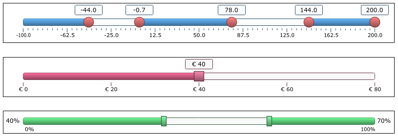

# CanvasSlider

CanvasSlider is a lightweight JavaScript range slider.

Most of the range slider controls use Javascript and a stylesheet.

This slider uses a HTML5 canvas element to draw a slider without the need of a stylesheet.

It is easy to maintain and gives a lot of flexibility. 

# Features

- Pure Javascript, no dependencies required.
- No dedicated stylesheet needed.
- All modern browsers are supported.
- Multiple handles: one, two or more handles.
- Change the slider value by dragging the handle or clicking on the track.
- Create a snapshot image of the slider.
- The ability of the handle to either snap to tick values or to be positioned at any point along the slider.
- Auto-generate a range of evenly spaced discrete values.
- Simple number formatting.
- Multiple handler shapes. 
- User defined color schemes. 

# Demo

You can try and see a demo application on the included web page. 

Screenshots:

   

# Documentation

Documentation can be found on the web page included in this project.

# License

CanvasSlider is licensed [MIT](https://choosealicense.com/licenses/mit/).

It can be used for free in any personal or commercial project.

